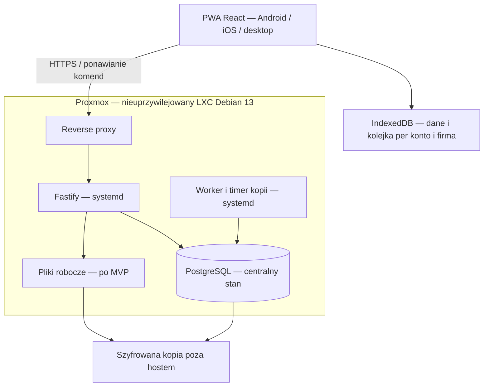

# SiteGrid — architektura produktu (PR #2)

Data: 2026-10-09. SiteGrid jest niezależnym produktem wielofirmowym, a HERC pozostaje wyłącznie analizowaną aplikacją referencyjną. **Status: kierunek architektury przyjęty w PR #2; brak implementacji i wdrożenia.** Szczegółowe mechanizmy oraz proponowane limity wymagają dalszej walidacji i zatwierdzenia. Dokument zastępuje wcześniejszy wariant „MVP online, offline później”. Historyczne obserwacje pozostają w [FUNCTIONALITY.md](FUNCTIONALITY.md).

## Decyzje produktowe

- Jedna instalacja obsługuje wiele firm, z izolacją wszystkich danych i operacji między tenantami. Użytkownik ma jedną tożsamość i może należeć do kilku firm, z innymi rolami w każdej.
- Administrator platformy tworzy firmy i pierwszych administratorów. Administrator firmy zarządza kontami, rolami i pracownikami wyłącznie własnej firmy. Nie ma publicznej rejestracji.
- Pierwszy dostęp wymaga bezpiecznej jednorazowej aktywacji. Hasła nie są nadawane ani przekazywane przez administratora.
- Nazwa, logo i ustawienia firmy są w PostgreSQL. `.env`/konfiguracja usług zawiera wyłącznie konfigurację instalacji i sekrety infrastruktury, nigdy branding, listę firm ani role.
- Jedna instalowalna PWA React/TypeScript dla Androida, iOS i desktopu; bez osobnej aplikacji natywnej. Fastify jest jedyną bramą do centralnego PostgreSQL. Bez Supabase, także dla logowania, plików i synchronizacji.
- Offline-first dla podstawowej pracy jest warunkiem MVP: IndexedDB, trwała kolejka, retry, idempotencja i jawne konflikty. Brak cichego nadpisywania.
- Hosting: Debian 13/systemd w LXC, VM, bare metal lub na hoście Proxmox VE; wybór użytkownika. Modularny monolit, bez wymogu Redis, Kubernetes czy mikroserwisów.

## Małe MVP i granica offline

| Operacja | MVP | Bez sieci po przygotowaniu urządzenia |
|---|---|---|
| Firma, branding, konta, aktywacja, role, przydziały | Tak | Nie; wymagane aktualne uprawnienia i odpowiedź serwera. |
| Projekty i proste zadania: opis, wykonawca, status | Tak | Odczyt wcześniej pobranych projektów i przypisanych zadań. Tworzenie projektu/zadania i zmiana przydziału online. |
| Rozpoczęcie zadania, zgłoszenie wykonania lub przeszkody | Tak | Lokalna operacja i kolejka; skuteczność serwerowa dopiero po synchronizacji. |
| Własny wpis pracy: dzień, opis, opcjonalna liczba minut | Tak | Utworzenie i korekta własnego niezatwierdzonego wpisu, trwale kolejkowane. To roboczy zapis, nie ewidencja płac. |
| Odbiór lub zwrot zadania przez kierownika | Tak | Tylko online, na aktualnej wersji; wykonawca nie odbiera własnej pracy. |
| Przełączanie firm | Tak | Wyłącznie do wcześniej przygotowanego, nadal lokalnie ważnego zakresu; brak mieszania kolejek. |

Poza MVP: magazyn/zakupy, PDF i zdjęcia, pinezki, czat, kalendarz, budżety, pełne brygady, raporty zbiorcze z akceptacją, zależności harmonogramu, powiadomienia. Nie są warunkami pierwszego pilotażu. Pliki robocze i ich kolejka pojawią się oddzielnie; logo jest częścią MVP.

Pierwsza aktywacja, logowanie na nowym urządzeniu, instalacja/pobranie powłoki oraz przygotowanie projektu wymagają połączenia. UI pokazuje „gotowe offline” dopiero po kompletnym zapisaniu powłoki i danych; nie udaje dostępności niepobranych projektów. Proponowany maksymalny okres dostępu offline: 7 dni od ostatniego potwierdzenia uprawnień online. Po tym czasie blokada dostępu do danych do ponownej autoryzacji, bez automatycznego usunięcia kolejki. Ten limit wymaga akceptacji przy zatwierdzeniu architektury.

## Topologia i eksploatacja

Osobne konta systemowe usług; API i PostgreSQL na loopback/socket, użytkownicy przez HTTPS. React budowany w CI i dostarczany jako statyczny artefakt; API/worker z przypiętym runtime i migracjami. Bez Docker-in-LXC/nesting. LXC współdzieli jądro hosta. Panel Proxmoxa i uprawnienia systemowe są oddzielone od panelu administratora platformy.

Początkowa hipoteza zasobów: 4 vCPU, 8 GB RAM, 40 GB systemu plus policzony wolumen danych; wymaga pomiarów. Szablon Debian 13, wersja Proxmoxa, mapowanie UID/GID i zakres backupu rootfs/mount pointów muszą być sprawdzone przed wdrożeniem. Nie zakładać objęcia bind mountów kopią kontenera. Kod w `/opt/sitegrid/releases`, przyszłe pliki w `/srv/sitegrid/files`, sekrety w chronionej konfiguracji usług poza repozytorium.

MVP: kopia PostgreSQL obejmuje także branding i logo. Później spójna kopia DB i plików z manifestem, przy zatrzymaniu zapisów i workera. Proponowane cele RPO 24 h / RTO 4 h wymagają zatwierdzenia i próby odtworzenia do odizolowanego LXC. Snapshot na tym samym hoście nie zastępuje kopii. Monitorować błędy, miejsce, kolejkę serwera i wiek kopii; nie logować payloadów, haseł, tokenów aktywacji ani cookies. Backup serwera nie obejmuje jeszcze niewysłanych zmian urządzenia.

## Instalacja i cykl wydania od pierwszej wersji

SiteGrid wymaga **instalatora one-line, aktualizatora i bezpiecznego rollbacku już w pierwszym działającym przyroście M01**, razem z minimalnym logowaniem administratora platformy. Docelowa pełna obsługa wielu firm pozostaje w kolejnych etapach; nie wolno wystawiać surowego szkieletu lub konta testowego jako działającej instalacji.

- **Jedyna warstwa instalacji — gotowy Debian 13:** operator samodzielnie przygotowuje LXC/VM lub serwer z Debianem 13. Następnie uruchamia w nim jedno polecenie instalatora, który pobiera zaufany, przypięty artefakt, weryfikuje wydawcę i integralność, instaluje zależności/PostgreSQL/nginx/Node runtime/SiteGrid i konfiguruje systemd. Miejsce wybiera użytkownik; host Proxmox VE z Debianem 13 jest dopuszczalny. Nie tworzymy CT/VM i nie wymagamy wcześniejszego transferu plików. Repozytorium i GitHub Releases llit47/sitegrid są publiczne; klient sprawdza podpis Ed25519 przypiętym kluczem i SHA-256 paczki bez poświadczeń GitHub. Pierwszy Release wymaga zatwierdzenia użytkownika.
- **Artefakty:** wydania z przypiętą wersją i weryfikacją integralności; pliki programu w `/opt/sitegrid/releases/<wersja>`, atomowo przełączany `/opt/sitegrid/current`; konfiguracja i dane trwałe poza katalogiem wydania. Nie uruchamiać produkcyjnej instalacji z ruchomego HEAD `main`.
- **Zarządzanie w LXC:** `sitegrid update`, `sitegrid rollback`, `sitegrid status`; blokada równoległych operacji, backup przed migracją, przerwanie przy niezgodności, `systemd`, testy gotowości. Rollback kodu nie może udawać rollbacku PostgreSQL; przy niezgodnym schemacie wymaga kontrolowanego odtworzenia.
- **Kontrola jakości:** smoke test jednego polecenia instalacji na czystym Debianie 13 (bez wstępnego kopiowania plików), uruchomienia, logowania, ponowienia/przerwania instalacji, aktualizacji, uszkodzonego wydania i zgodnego rollbacku bez utraty danych. Nie wymagamy testowania skryptów `pct`, ponieważ instalator nie tworzy maszyn i nie korzysta z API Proxmoxa. Kolejne migracje i aktualizacje PWA nie mogą gubić niesynchronizowanej kolejki.

Konkretne kryteria zakończenia pierwszego przyrostu określa [ROADMAP.md](ROADMAP.md), sekcja **M01**.

## Model danych i izolacja

| Encje | Własność / reguła |
|---|---|
| `users`, `credentials`, `sessions` | Globalna tożsamość, hasło i sesje. Administrator firmy nie przegląda globalnego katalogu kont ani nie zmienia cudzych danych logowania. |
| `platform_admins` | Osobne uprawnienie platformowe; nie jest rolą nadawaną przez administratora firmy. |
| `organizations` | Firma i stan aktywności. Nazwa i identyfikator należą do danych DB. |
| `organization_settings`, `organization_logos` | Wersjonowane, walidowane ustawienia; logo jako ograniczone rozmiarem `bytea` w PostgreSQL wraz z MIME i wersją. Nie tylko ścieżka do logo w `.env`. |
| `organization_memberships`, `membership_roles` | Unikalne `(organization_id, user_id)`, stan oczekujące/aktywne/nieaktywne, role per firma. |
| `employees` | Profil pracownika per firma, opcjonalne powiązanie z członkostwem. Dezaktywacja zachowuje historię; pracownik nie musi mieć konta. |
| `account_invitations` | Firma, odbiorca, cel, hash sekretu, termin, stan wykorzystania; dostęp tylko dla uprawnionego administratora. |
| `projects`, `project_memberships`, `tasks`, `work_entries` | Obowiązkowe `organization_id`; projektowe rekordy mają `project_id`, wersję i autora; przypisanie tylko do aktywnego członka firmy i projektu. |
| `audit_events`, `command_receipts` | Audyt zmian i wyniki idempotencji w zakresie firmy/aktora; zapis atomowy ze zmianą biznesową. |

Każda relacja tenantowa używa złożonych kluczy i więzów, np. `(organization_id, project_id)`, również dla pracownika i wykonawcy. Nie wolno połączyć zasobu firmy A z członkostwem B. Ten sam człowiek w dwóch firmach ma oddzielne profile pracownicze, role i historię. Projekt należy do jednej firmy; współpraca podwykonawcy wymaga jawnego członkostwa w tej firmie i projekcie, nie automatycznego łączenia tenantów.

API bierze aktora z sesji, sprawdza członkostwo dla wskazanego kontekstu i ustawia zakres transakcji; nie ufa `organization_id` z payloadu. Kontekst jest jawny w każdym żądaniu, nie jako globalny przełącznik sesji mogący zmienić znaczenie żądań z innej karty. Wyszukiwanie, odczyt pojedynczego ID, pliki/logo, eksporty, kopie aplikacyjne, worker i synchronizacja stosują ten sam zakres. Brak uprawnienia nie ujawnia istnienia obcego rekordu.

RLS jest dodatkową barierą: `ENABLE`/`FORCE ROW LEVEL SECURITY` na tabelach tenantowych; rola runtime bez superuser/`BYPASSRLS`, niebędąca właścicielem tabel. Migracje osobną rolą; kontekst ustawiany lokalnie w transakcji po autoryzacji i nieprzenoszony między połączeniami puli. Warstwa API dodatkowo egzekwuje role, projekty i relację do rekordu. PostgreSQL opisuje wyjątki dla ról uprzywilejowanych — pełna izolacja aplikacyjna nie oznacza ukrycia danych przed operatorem systemu lub bazy. [Dokumentacja RLS](https://www.postgresql.org/docs/current/ddl-rowsecurity.html).

Panel platformy ma oddzielne endpointy i polityki do tworzenia firmy/pierwszego administratora. Nie daje domyślnie dostępu do zadań, wpisów ani plików firm i nie stosuje nieograniczonego połączenia superuser. Czynności platformowe mają oddzielny audyt. Szczegółowe reguły: [PERMISSIONS.md](PERMISSIONS.md).

## Konta, aktywacja i sesje

1. Pierwszy administrator platformy jest przygotowywany kontrolowaną jednorazową procedurą operatora, bez publicznego endpointu bootstrap. To jedyne konto startowe; późniejsze firmy i pierwszych administratorów tworzy panel platformy.
2. Administrator platformy tworzy firmę i zaproszenie pierwszego administratora. Administrator firmy tworzy profil pracownika i oczekujące członkostwo/konto lub zaprasza istniejącą tożsamość. Odpowiedź nie ujawnia członkostw w innych firmach. Zaproszenie nie aktywuje dostępu samoistnie.
3. Nowe konto otrzymuje jednorazowy link przez skonfigurowaną pocztę transakcyjną. Sekret generowany CSPRNG (propozycja: 32 bajty), w DB tylko hash, termin ważności 24 h, związanie z odbiorcą, firmą i celem. Ponowne zaproszenie unieważnia poprzednie. Dostawa wiadomości weryfikowana przy wdrożeniu; brak wspólnych haseł startowych.
4. Otwarcie linku GET niczego nie aktywuje (także przez skaner poczty). Strona bez skryptów zewnętrznych, analityki i cache; sekret w fragmencie URL przenoszony do pamięci i usuwany z adresu, wysłany dopiero w POST. Brak logowania treści aktywacji; `Referrer-Policy: no-referrer`. Niewykorzystany, niewygasły token jest atomowo zużywany razem z ustawieniem hasła i aktywacją członkostwa. Dwie równoczesne próby nie mogą go użyć dwukrotnie.
5. Osoba z istniejącą tożsamością loguje się na właściwe konto i jednorazowo przyjmuje zaproszenie do kolejnej firmy. Administrator tej firmy nie resetuje jej globalnego hasła. Przyjęcie zaproszenia wymaga zgodnego odbiorcy, ważnego zaproszenia i aktywnej firmy.
6. Po aktywacji użytkownik loguje się normalnie. Hasła: Argon2id, parametry dobrane pomiarem. Sesja serwerowa, losowy identyfikator w cookie `Secure`, `HttpOnly`, `SameSite`; rotacja przy logowaniu, CSRF, limity prób. Brak sekretów sesji w IndexedDB/localStorage. Odzyskiwanie konta stosuje osobny jednorazowy, wygasający przepływ; nie stanowi publicznej rejestracji.

Jednorazowość, losowość, bezpieczne przechowanie i wygaśnięcie sekretów bazują na zaleceniach [OWASP dla tokenów odzyskiwania dostępu](https://cheatsheetseries.owasp.org/cheatsheets/Forgot_Password_Cheat_Sheet.html); opis aktywacji i konkretne limity są decyzją tego projektu. Dostawca poczty otrzymuje token potrzebny do dostarczenia linku — jego retencja i dostęp muszą być ograniczone; token nie trafia do audytu aplikacji.

Dezaktywacja konta przez administratora firmy oznacza dezaktywację członkostwa w tej firmie, unieważnienie jej zaproszeń i uprawnień, a nie globalnej tożsamości. Działa przy każdym kolejnym żądaniu i synchronizacji; pozostałe firmy pozostają dostępne. Globalne blokowanie konta należy do platformy i unieważnia wszystkie sesje. Nie wolno zdezaktywować ostatniego aktywnego administratora firmy bez atomowego przekazania obowiązków. Reaktywacja dostępu jest jawna i audytowana.

## PWA i instalacja

Manifest, stabilne `id`/`start_url`, ikony i tryb `standalone`; HTTPS oraz service worker dla powłoki offline. Jedna instalacja PWA zawiera przełącznik firm; ikona instalacji jest ogólną ikoną produktu, a branding aktywnej firmy pobierany jest z DB. Android: instrukcja instalacji z menu przeglądarki i dostępny mechanizm instalacji. iOS: instrukcja dodania do ekranu głównego. UI nie uzależnia instalacji od jednego programowego promptu. Mechanizmy różnią się między przeglądarkami. [MDN — instalowalność PWA](https://developer.mozilla.org/en-US/docs/Web/Progressive_web_apps/Guides/Making_PWAs_installable).

Synchronizacja obowiązkowo uruchamia się po otwarciu/wznowieniu aplikacji, odzyskaniu połączenia i ręcznym „Synchronizuj”. Działanie w tle jest wyłącznie optymalizacją, bez obietnicy wysłania danych z zamkniętej PWA na Android/iOS. Service worker i IndexedDB nie gwarantują nieusuwalnej pamięci urządzenia. Obsłużyć odmowę miejsca, ewentualne usunięcie danych przez system/użytkownika i ostrzeżenie o niewysłanej pracy; prośba o persistent storage jest tylko dodatkowym zabezpieczeniem. [MDN — offline i zadania w tle](https://developer.mozilla.org/en-US/docs/Web/Progressive_web_apps/Guides/Offline_and_background_operation).

## Kontrakt offline-first w MVP

**Lokalny zapis.** IndexedDB przechowuje oddzielnie stan potwierdzony przez serwer, szkice/projekcję oczekujących zmian i kolejkę komend. Klucz zakresu: konto + firma + projekt. Jedna transakcja IndexedDB zapisuje zmianę i komendę; dopiero jej sukces pozwala pokazać „zapisano na urządzeniu”. Błąd quota/transakcji nie może wyglądać jak sukces. Cache Storage zawiera powłokę, nie przypadkowe odpowiedzi API z danymi firm.

**Komenda.** `operation_id` UUID, `organization_id`, `project_id`, zasób, typ, wersja bazowa, wersja schematu payloadu, dane i zależność od poprzedniej komendy. Aktor wynika z sesji, a identyfikator lokalnego właściciela zapobiega wysłaniu kolejki przez inne konto. Komendy na jednym zasobie są uporządkowane; kolejne czekają na wynik poprzedniej. Przy wielu kartach jedna dzierżawa synchronizacji w IndexedDB; idempotencja serwera pozostaje zabezpieczeniem rozstrzygającym. Nowe wpisy otrzymują UUID na urządzeniu.

**Retry i restart.** Trwałe stany: oczekuje, wysyłanie, potwierdzono, konflikt, wymaga logowania, odrzucono. Restart odzyskuje przerwane wysyłanie z tym samym ID i payloadem. Timeout/utrata odpowiedzi/5xx: wykładniczy backoff z jitterem i limitem częstotliwości; 429 respektuje `Retry-After`; 401 wstrzymuje do logowania; 403 zatrzymuje zakres i wymusza ponowną ocenę dostępu; błędy walidacji wymagają poprawy, nie pętli retry. Zdarzenie `online` tylko inicjuje próbę, nie dowodzi dostępności serwera. UI pokazuje kolejkę, błąd, czas ostatniego potwierdzenia i odróżnia „na urządzeniu” od „na serwerze”.

**Idempotencja.** Unikalne `(organization_id, actor_id, operation_id)` i hash kanonicznego payloadu. W jednej transakcji: aktualne uprawnienia, deduplikacja, oczekiwana wersja, przejście statusu, zmiana, audyt i wynik komendy. Równoległe duplikaty rozstrzyga unikalność/blokada. Powtórzony identyczny zapis zwraca wcześniejszy wynik; ten sam ID z inną treścią jest błędem. Sprawdzenie aktualnych uprawnień poprzedza także odczyt starego wyniku. Potwierdzone identyfikatory komend w MVP nie są automatycznie usuwane; przyszła retencja musi zapewnić odrzucenie zbyt starych retry, zanim skróci deduplikację.

**Konflikt.** `expectedVersion` sprawdzana atomowo; niezgodność daje 409 z aktualną dozwoloną wersją. Klient zachowuje bazę, lokalną propozycję i serwerowy stan, wstrzymuje zależne komendy i daje porównanie. Użytkownik wybiera rezygnację z lokalnej zmiany albo świadomie buduje nową komendę na aktualnej wersji (nowe ID); reguły przejść nadal obowiązują. Niezależne wpisy o różnych UUID można dołączyć, ale edycji wspólnego pola/statusu nigdy nie rozstrzyga automatycznie „ostatni zapis wygrywa”. Usunięcie/archiwizacja obiektu nie odtwarza go przy retry.

**Pobieranie.** Dla małego MVP pełny, ograniczony rozmiarem snapshot wybranego projektu zamiast od razu budować strumień przyrostowy. Limit liczby rekordów i rozmiaru odpowiedzi ustalić przed implementacją; przekroczenie daje jawny brak gotowości offline, nie ucięty zbiór. Snapshot jest spójny transakcyjnie, ograniczony uprawnieniami; zastępuje potwierdzoną lokalną bazę atomowo, pozostawiając kolejkę i lokalne propozycje. Brak rekordu w kompletnym snapshotcie usuwa go z cache; niekompletna odpowiedź nie usuwa niczego. Przed pobraniem/wysłaniem odświeżyć zakres dostępu; po wysłaniu pobrać nowy snapshot. Odebranie projektu wymusza usunięcie jego cache. W przyszłości: paginowany snapshot z trwałą granicą i kursor zmian/tombstones; nie używać samego numeru przydzielonego przed commitem jako bezpiecznego kursora.

**Konto i utrata dostępu.** Przełączenie firmy nie zmienia właściciela już utworzonych komend. Kolejka firmy A może być obsłużona tylko jako A po nowej autoryzacji; nigdy wysłana jako B. Wylogowanie ostrzega o niewysłanych zmianach: użytkownik synchronizuje, anuluje wylogowanie albo jawnie odrzuca dane. Zakończone lokalne wylogowanie czyści dane/queue/cache konta przed dopuszczeniem innej osoby; brak sieci uniemożliwia natychmiastowe unieważnienie cookie na serwerze, więc klient blokuje dalsze użycie tej sesji do potwierdzonego wylogowania online i nowego logowania. Nie utożsamiać tego z samym zamknięciem PWA, które zachowuje kolejkę.

Po potwierdzonej utracie uprawnień klient blokuje synchronizację i usuwa dane oraz komendy odebranego zakresu, pokazując informację o odrzuceniu niewysłanej pracy. Serwer nie przyjmuje zmian tylko dlatego, że powstały przed odebraniem roli. Zdalne cofnięcie uprawnienia nie usuwa natychmiast danych z urządzenia bez sieci; limit offline ogranicza zwykłe użycie, lecz nie stanowi ochrony przed właścicielem zmodyfikowanego klienta. Izolacja między tenantami w aplikacji i serwerze pozostaje obowiązkowa; ochrona utraconego urządzenia wymaga także blokady systemowej.

**Odtworzenie serwera.** Każdy snapshot i komenda mają epokę synchronizacji instalacji. Restore zmienia epokę przed dopuszczeniem klientów; różnica blokuje automatyczny replay i wymaga uzgodnienia danych. Pozwala to uniknąć odtworzenia komend na bazie, która utraciła ich wcześniejsze potwierdzenia.

**Aktualizacje.** Migracje IndexedDB i aktualizacja service workera zachowują niewysłane operacje. Nie czyścić kolejki przy nowej wersji klienta ani pełnym odświeżeniu. API rozpoznaje wersję komendy; nieobsługiwany schemat zatrzymuje synchronizację z instrukcją aktualizacji, bez pozornego sukcesu.

## Statusy i minimalna kontrola jakości

Zadanie: `zaplanowane → w toku → zgłoszone do odbioru → odebrane`; kierownik może zwrócić do pracy z powodem. Przeszkoda jest oddzielnym wpisem. Czasy zdarzeń serwerowe UTC, dzień pracy w strefie projektu; czas urządzenia nie ustala kolejności rozstrzygania konfliktów. Wpis pracy należy do autora; inna osoba nie koryguje go bez jego wiedzy. Audyt obejmuje aktora, firmę, zasób, komendę i wersje bez sekretów.

Bramka pilotażu: izolacja dwóch firm przy wspólnym użytkowniku, aktywacja i jej replay, dezaktywacja tylko jednej firmy, trwałość kolejki po restarcie, utrata odpowiedzi po commicie, równoległe retry, konflikt dwóch urządzeń, cofnięcie dostępu, brak miejsca, aktualizacja PWA oraz odtworzenie DB. Wszystko na danych syntetycznych. Instalacja i ten sam proces offline na fizycznym Androidzie i iPhonie są warunkiem ukończenia MVP. Szczegóły: [roadmapa](ROADMAP.md).

## Do zatwierdzenia razem z architekturą

Mały zakres MVP i jego ograniczenia online; 7 dni dostępu offline; aktywacja 24 h; RPO/RTO; brak automatycznej retencji identyfikatorów komend w MVP. Przed wdrożeniem ustalić domenę/HTTPS, dostawcę poczty, retencję danych pracowników i limity snapshotów/logo. Nie są to wyniki testów ani deklaracja gotowości produktu.

## Implementacja M07 w PR12

[Projekty, przydziały i zadania online](../PROJECTS_TASKS.md) realizują model tenantowy z FORCE RLS, złożonymi FK firmy/projektu/członkostwa, lokalnym kontekstem projektu po autoryzacji, wersjami i transakcyjnym audytem. Schemat 9 zachowuje dane PR11. Wszystkie zadania zaczynają jako `planned`; przejścia statusu, idempotentne komendy, PWA i offline pozostają poza tym przyrostem. Dostęp do zadań jest przecięciem istniejącej roli firmowej i aktywnego przydziału projektowego. Metadane administracyjne firmy nie rozszerzają tego zakresu.
