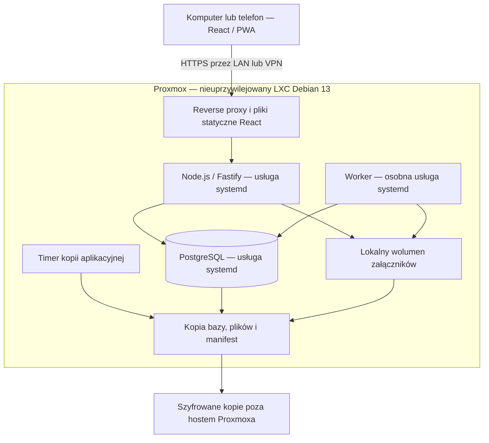

# Własna aplikacja self-hosted — propozycja architektury

Data: 2026-10-09. **wnioskowana:** wszystkie decyzje projektowe w tym dokumencie są rekomendacją dla własnej aplikacji. **potwierdzona:** UI i inicjalizacja klienta HERC wskazują Supabase dla dostępu i danych projektów/folderów/zadań oraz osobne dane lokalne (V05/V17–V24). **niezweryfikowana:** pełny backend, schemat bazy i egzekwowanie uprawnień HERC. Adres aplikacji nie jest dowodem jej pełnego stosu technologicznego. Niczego nie wdrożono.

## Założenia do potwierdzenia

**niezweryfikowana:** liczba jednoczesnych użytkowników, wolumen zdjęć, sprzęt Proxmoxa, dostępność z internetu/VPN, liczba firm, wymagania retencji, integracje i tolerancja przestoju. **wnioskowana:** rozpocząć od niewielkiego pilotażu i modularnego monolitu. Mikroserwisy, Kubernetes, Redis i osobny silnik wyszukiwania nie są potrzebne do pierwszego zakresu. Docelowe wersje wspieranych komponentów przypiąć w przyszłym PR technicznym po sprawdzeniu ich cyklu wsparcia.

## Decyzje wynikające z audytu — wnioskowana

V17–V24 pokazują mieszanie danych lokalnych i online. Własna aplikacja ma jeden serwerowy stan projektów, zadań, obecności, raportów, kalendarza i magazynu; urządzenie przechowuje wyłącznie jawnie opisany cache/szkic. Interfejs pokazuje stan synchronizacji modułu i konkretnego zapisu. Nie importujemy żadnych danych HERC.

Hierarchia projektu/folderu z V07–V13 uzasadnia lokalizacje robót wiążące zadania i dokumenty. V19 rozróżnia bieżący stan zadań od dnia raportu: zapis raportu powinien utrwalać własny snapshot podsumowania, a nie zmieniać historyczny wynik przy każdym odczycie. `worker` widzi Pulpit kierownika, ale nie badano kontroli serwera — nasza macierz jest osobnym projektem.

## Topologia: LXC Debian 13 na Proxmoxie — decyzja zakresowa

**potwierdzona:** użytkownik wybrał LXC Debian 13 zamiast wcześniejszej VM. Poniższe szczegóły są **wnioskowaną** propozycją wdrożenia, nie wykonaną konfiguracją.

**wnioskowana:** jeden nieuprzywilejowany kontener systemowy LXC z Debianem 13, usługami systemd i oddzielnymi kontami systemowymi proxy/API/PostgreSQL/workera. Frontend budowany w CI, dostarczany jako pliki statyczne; API i worker jako wersjonowane artefakty Node.js z przypiętym runtime. Bez Docker-in-LXC, nesting i uruchamiania aplikacji na hoście hypervisora. LXC współdzieli jądro hosta; nie traktować go jak odrębnego jądra VM. Wersję Proxmoxa, dostępność szablonu Debian 13 i mapowanie UID/GID sprawdzić przed wdrożeniem.

**wnioskowana:** początkowy budżet do pomiaru: 4 vCPU, limit 8 GB RAM, około 40 GB systemu oraz osobny wolumen danych według załączników i retencji. To nie wynik benchmarku. Ograniczyć zużycie CPU/RAM/dysku, monitorować zapas; pojedynczy host i kontener nie zapewniają HA. Dane PostgreSQL pod katalogiem zarządzanym przez usługę bazy; pliki np. `/srv/herc/files`, kod w wersjonowanym `/opt/herc/releases`, sekrety poza repo w chronionym pliku konfiguracji usługi. Prawa zapisu API/workera tylko do potrzebnych katalogów. Uzgodnić właścicieli mount pointów z mapowaniem nieuprzywilejowanego LXC.

**wnioskowana:** reverse proxy udostępnia HTTPS; API nasłuchuje na loopback, PostgreSQL przez lokalny socket lub loopback. Firewall ogranicza wejście do HTTPS i kontrolowanej administracji; panel Proxmoxa nie jest panelem aplikacji. Pilotaż przez LAN/VPN. Wybór domeny, certyfikatu i dostępu publicznego pozostaje decyzją operacyjną. Ograniczenia systemd dopasować do rzeczywistych ścieżek zapisu i sprawdzić w testowym LXC.

**wnioskowana — wolumeny i kopie:** preferować mount point zarządzany przez storage Proxmoxa, z jawnie ustalonym objęciem kopią. Dla bind mountów nie zakładać, że backup kontenera obejmuje zawartość hostowego katalogu; zaplanować oddzielną kopię i test odtworzenia. Lista rootfs/mount pointów, ich zawartość i zakres kopii są częścią manifestu operacyjnego. Snapshot kontenera sam nie dowodzi spójności PostgreSQL i załączników. Wykonać spójną kopię aplikacyjną oraz próbę odtworzenia do nowego, odizolowanego LXC.

**potwierdzona — źródła i granice:** oficjalna strona [Debian 13 — trixie](https://www.debian.org/releases/trixie/) potwierdza wydanie Debian 13. Odczyt [Proxmox — Linux Container](https://pve.proxmox.com/pve-docs/chapter-pct.html) w tej sesji zwrócił HTTP 403; nie ponawiano tego żądania ani nie obchodzono blokady. Dlatego dokładne opcje mount pointów, backupu i wsparcia szablonu są **niezweryfikowane w docelowym środowisku** i stanowią kryteria PR operacyjnego. Nie wdrażano usług.

## Frontend, API i podział odpowiedzialności — wnioskowana

- **React + TypeScript:** wspólna nawigacja, jawny kontekst firmy/projektu, widoki według roli, formularze i mobilna „moja praca”. Serwer jest źródłem prawdy; cache zapytań nie zastępuje autoryzacji.
- **Node.js + Fastify:** REST pod `/api/v1`, kontrakty wejścia/wyjścia, paginacja, limity załączników, spójny format błędu z kodem, błędami pól i identyfikatorem żądania. Moduły: identity, organizations, projects, crews, tasks, reports, inventory, files, defects, calendar, audit, sync.
- **PostgreSQL:** transakcje, więzy, migracje i jeden model prawdy o stanie biznesowym. Worker korzysta z tabeli zadań/outbox; można uruchomić go jako osobny proces tego samego kodu.
- **Współdzielone kontrakty:** schematy i klient API dla web/PWA, później aplikacji natywnej. Reguły biznesowe i kontrola dostępu pozostają na serwerze.

**potwierdzona — dokumentacja technologii:** Fastify obsługuje walidację i serializację opartą na schematach, w tym JSON Schema. **wnioskowana:** schematy definiować w kodzie, a sprawdzenie uprawnień i zależności w bazie wykonywać po walidacji struktury. Źródło: [Fastify — Validation and Serialization](https://fastify.dev/docs/latest/Reference/Validation-and-Serialization/).

## Model wielu firm i relacji — wnioskowana

| Encje | Relacja i ograniczenie |
|---|---|
| `users`, `organizations`, `organization_memberships` | Tożsamość globalna, członkostwo i rola per firma; jedna osoba może należeć do kilku firm. |
| `projects`, `project_memberships` | Projekt należy do jednej organizacji; członkostwo projektowe zawęża dostęp. Dostęp do firmy nie daje automatycznie prawa do każdego projektu. |
| `crews`, `crew_memberships`, `crew_project_assignments` | Brygada należy do firmy; daty członkostwa i przypisania projektu pozwalają odtworzyć obsadę w przeszłości. |
| `work_locations` | Drzewo lokalizacji/folderów w projekcie; rodzic w tym samym projekcie, bez cykli. Zadanie i dokument mogą wskazywać lokalizację. |
| `calendar_events` | Firma, opcjonalny projekt, zakres czasu i strefa projektu, opis; uprawnienia zgodne z kontekstem. Wydarzenie nie zastępuje dostawy ani zależności zadania. |
| `tasks`, `task_assignments`, `task_dependencies` | Projekt, lokalizacja robót, termin, priorytet, wersja, przydział osoby/brygady; zależności bez cykli i w obrębie dozwolonego projektu. |
| `daily_reports`, `report_lines`, `time_entries` | Raport wiąże projekt, dzień roboczy, brygadę, pozycje pracy i snapshot podsumowania z chwili złożenia; korekty zatwierdzonych wersji są jawne. |
| `materials`, `warehouses`, `stock_movements`, `reservations` | Ruch niezmienny po zatwierdzeniu; korekta przez ruch odwracający. Rezerwacja nie jest wydaniem. Jednostki i ilości o ustalonej precyzji. |
| `requisitions`, `requisition_lines`, `deliveries` | Zapotrzebowanie i częściowe realizacje; przyjęcie magazynowe powiązane z dostawą. |
| `documents`, `file_versions`, `file_links` | Kolejne wersje pliku, metadane w DB, treść na dysku, wiązanie z zasobem i projektem. |
| `defects`, `inspections` | Usterka ma odpowiedzialnego i termin, a odbiór osobny wynik i historię. |
| `audit_events`, `outbox_events`, `idempotency_keys` | Odrębne cele: rozliczalność zmian, dostarczenie zdarzeń, bezpieczne ponowienie komendy. |

**wnioskowana:** każda tabela biznesowa ma `organization_id`, a projektowa również `project_id`. Relacje złożone, np. `(organization_id, project_id)`, uniemożliwiają przypadkowe połączenie rekordów różnych firm. Wszystkie zapytania, wyszukiwania, pliki i eksporty podlegają temu samemu zakresowi dostępu. Indeksy dopasować do kontekstu firmy/projektu, statusu i terminów. ID zasobu nie stanowi uprawnienia.

**wnioskowana:** w MVP współpraca podwykonawcy to jawne członkostwo jego użytkownika w wybranym projekcie organizacji właściciela, bez dostępu do pozostałych danych. Docelowe relacje `project_partners` wymagają ustalenia właściciela informacji i dokładnie udostępnianych zasobów. Nie łączyć tenantów automatycznie po nazwie budowy. Utrata członkostwa zatrzymuje nowe odczyty, zapisy, pobrania i synchronizację.

## Uprawnienia i uwierzytelnianie — wnioskowana

Model: rola + zakres firmy/projektu/brygady + relacja użytkownika do konkretnego rekordu. Domyślnie odmowa. UI ukrywa niedostępne operacje, lecz API sprawdza je niezależnie.

| Rola | Zakres i domyślne możliwości | Granica |
|---|---|---|
| Administrator firmy | Członkostwa, role, konfiguracja i historia administracyjna swojej firmy. | Nie uzyskuje dostępu do innych firm; dostęp do treści projektów nadawany jawnie. |
| Kierownik budowy | Plan, przydziały, raporty i odbiory przypisanych projektów. | Dane finansowe wymagają dodatkowego uprawnienia. |
| Brygadzista | Zadania swojej brygady, raport zbiorczy, zgłoszenie wykonania. | Nie odbiera automatycznie własnych robót jako kierownik. |
| Pracownik | Własne/przydzielone zadania, instrukcje, własny raport i zgłoszenie przeszkody. | Brak danych kadrowych innych osób i edycji zatwierdzonych raportów. |
| Magazynier | Przydzielone magazyny, rezerwacje, przyjęcia, wydania i korekty. | Bez administracji użytkownikami i swobodnej zmiany historycznego salda. |

**wnioskowana:** operator platformy nie jest zwykłym administratorem firmy. Dostęp serwisowy do danych powinien być wyjątkowy, czasowy i rejestrowany. Macierz jest punktem wyjścia do rozmów, nie potwierdzonym modelem HERC.

**wnioskowana:** lokalne konta na początek, hasła haszowane sprawdzoną implementacją Argon2id z parametrami dobranymi pomiarem na serwerze. Losowe identyfikatory sesji w ciasteczkach `Secure`, `HttpOnly`, `SameSite`; sesje przechowywane po stronie serwera, odwoływalne, z ograniczeniem bezczynności i czasu życia. Ochrona CSRF operacji zmieniających dane oraz ograniczenie prób logowania. Nie przechowywać tokenów dostępowych w localStorage. Administrator: MFA przed udostępnieniem publicznym; odzyskiwanie konta przez jednorazowy, wygasający mechanizm. Nie wprowadzać własnej kryptografii. OIDC rozważyć, jeśli użytkownik ma już dostawcę tożsamości.

**potwierdzona — dokumentacja technologii:** OWASP opisuje właściwości cookies sesyjnych, rotację identyfikatorów i unieważnianie sesji. Źródło: [Session Management Cheat Sheet](https://cheatsheetseries.owasp.org/cheatsheets/Session_Management_Cheat_Sheet.html). **wnioskowana:** powyższa konfiguracja wymaga późniejszej implementacji i testów, nie jest dowodem zabezpieczeń HERC.

**wnioskowana:** zastosować RLS jako dodatkową barierę izolacji firm. Kontekst organizacji ustawiany przez serwer lokalnie dla transakcji po sprawdzeniu członkostwa; brak kontekstu oznacza odmowę. Rola aplikacyjna bez `BYPASSRLS`, niebędąca właścicielem tabel; migracje osobną rolą. Testować reset kontekstu przy poolingu połączeń i workerach. RLS nie zastępuje reguł projektowych ani poprawnych kluczy obcych.

**potwierdzona — dokumentacja technologii:** PostgreSQL umożliwia polityki dostępu do wierszy; właściciele tabel i role uprzywilejowane mogą je omijać w opisanych w dokumentacji sytuacjach. Źródło: [PostgreSQL — Row Security Policies](https://www.postgresql.org/docs/current/ddl-rowsecurity.html).

## Statusy, transakcje i historia — wnioskowana

Proponowane statusy własnego produktu, **niezweryfikowane w HERC**:

- Zadanie: `zaplanowane → w toku → zgłoszone do odbioru → odebrane`; zwrot do pracy z powodem. Blokada osobnym atrybutem, anulowanie osobną operacją.
- Raport: `szkic → złożony → zatwierdzony` lub `do poprawy`; korekta zatwierdzonego raportu tworzy nową wersję.
- Zapotrzebowanie: `szkic → zgłoszone → zaakceptowane → częściowo zrealizowane → zrealizowane`; odrzucenie i anulowanie jawne.
- Usterka: `otwarta → w naprawie → do weryfikacji → zamknięta`; możliwe ponowne otwarcie z powodem.

**wnioskowana:** komenda zmieniająca stan w jednej transakcji sprawdza uprawnienia, wersję i przejście, modyfikuje dane oraz dopisuje audyt i outbox. Historia obejmuje aktora, zakres firmy/projektu, czas serwera, rodzaj operacji, zasób, wersję i ograniczony zestaw zmienionych pól. Bez haseł, cookies, tokenów i surowych treści dokumentów. Dane identyfikujące aktora w działającym systemie mają kontrolowany dostęp i retencję; nie są eksportowane do tego audytu. Rola aplikacji nie edytuje zdarzeń audytowych, ale administrator bazy technicznie może — nie nazywać tego niepodważalnym rejestrem.

**wnioskowana:** wersja rekordu i `If-Match`/`expectedVersion` wykrywają konflikt; API zwraca ustalony kod 409 lub 412 i informację do porównania. Dla magazynu blokada odpowiedniego salda/rezerwacji i transakcja chronią przed podwójnym wydaniem. Kwoty i ilości jako liczby dziesiętne; czas zdarzenia UTC, dzień raportu według strefy projektu. Korekty nie usuwają historii.

## Pliki lokalne — wnioskowana

Przechowywać treść poza katalogiem publicznym, pod nieprzewidywalnym kluczem technicznym; nazwa użytkownika wyłącznie w metadanych. Metadane: firma, projekt, rodzaj, rozmiar, suma kontrolna, rewizja, autor i stan dostępności. Każde pobranie autoryzowane w API; reverse proxy może dostarczyć plik dopiero po tej kontroli. Nie wystawiać wolumenu jako publicznego katalogu.

Przesyłanie: plik tymczasowy → kontrola limitu, typu i treści → stan oczekujący → atomowe przeniesienie na docelowym filesystemie → oznaczenie gotowości w DB. Baza i dysk nie mają wspólnej transakcji: worker uzgadnia niedokończone operacje, osierocone pliki i brakujące obiekty. Pobranie dopiero dla stanu gotowego. Rewizje niezmienne; usunięcie logiczne, fizyczne dopiero po retencji i sprawdzeniu odniesień. Adapter magazynu pozwoli później przejść na S3 bez zmiany API.

## Synchronizacja i przyszłe mobile — wnioskowana

1. **MVP online:** odświeżanie po zapisie i okresowe sprawdzanie zmian aktywnego projektu. Opcjonalne SSE wysyła informację o zmianie, a klient ponownie pobiera autoryzowany rekord. SSE nie zastępuje trwałego protokołu synchronizacji.
2. **Szkice terenowe:** service worker przechowuje powłokę aplikacji; IndexedDB wybrane dane i szkice per użytkownik/firma/projekt. Widoczne stany: lokalnie, w kolejce, wysyłanie, zsynchronizowano, konflikt, błąd. Osobny czas ostatniej synchronizacji.
3. **Kolejka komend:** UUID operacji, zasób, wersja bazowa i payload. API sprawdza uprawnienia przy każdym ponowieniu. Unikalny klucz idempotencji w zakresie firmy i aktora z hashem payloadu; identyczna operacja zwraca wcześniejszy wynik, inny payload z tym kluczem jest błędem. Zapisy biznesowe i wynik idempotencji atomowe.
4. **Odczyt przyrostowy:** kursor serwera, paginacja i tombstones dla usunięć. Kursor musi odpowiadać kompletnej, trwałej pozycji w strumieniu — sam rosnący numer przydzielony przed commitem może pominąć później zatwierdzoną transakcję. Użyć uporządkowanego publikatora po commicie albo protokołu z bezpiecznym nakładaniem i deduplikacją. Snapshot i strumień muszą mieć wspólną granicę; wygasły kursor wymusza ponowny snapshot.
5. **Konflikty:** notatki i zdjęcia można dołączać; równoczesna edycja opisu wymaga wyboru wersji. Wydania magazynowe, nadawanie ról i zatwierdzanie raportów tylko online w pierwszej wersji. Nie stosować bezwarunkowo „ostatni zapis wygrywa”.
6. **Utrata dostępu:** przy powrocie online serwer odrzuca komendy poza aktualnym zakresem, klient usuwa odpowiedni cache. Wylogowanie czyści cache/szkice zgodnie z jawną decyzją użytkownika o niewysłanych danych; dane nie mogą przejść do kolejnego konta. Odebranie roli nie usuwa zdalnie danych z urządzenia, które pozostaje offline — zakres cache i jego ważność wymagają decyzji biznesowej.
7. **Załączniki:** kolejka i retry oddzielone od tekstowych szkiców, limit rozmiaru i podgląd postępu. Synchronizacja działa po otwarciu aplikacji i ręcznym wznowieniu; nie zależy wyłącznie od zadań przeglądarki w tle. Aplikacja natywna później wykorzystuje te same kontrakty i reguły.

**potwierdzona — dokumentacja technologii:** service worker może obsługiwać cache i operacje offline, a mechanizmy pracy w tle mają ograniczenia zależne od środowiska. Źródło: [MDN — Offline and background operation](https://developer.mozilla.org/en-US/docs/Web/Progressive_web_apps/Guides/Offline_and_background_operation). **niezweryfikowana:** zgodność docelowej funkcji z telefonami użytkowników; potrzebne testy fizycznych urządzeń.

## Eksploatacja i odtwarzanie — wnioskowana

- Proponowane początkowe cele do uzgodnienia: RPO 24 godziny, RTO 4 godziny. Jeśli utrata dnia pracy jest niedopuszczalna, przed pilotażem zaprojektować częstsze kopie i odtwarzanie punktowe z równie spójnymi plikami.
- Prosty spójny backup: tryb utrzymania blokujący zapisy i upload, zakończenie transakcji, zatrzymanie workera, kopia DB i plików z manifestem, wznowienie pracy. Długość przerwy zmierzyć. Same nieskoordynowane snapshoty LXC nie są kryterium poprawnej kopii aplikacji.
- Kopie szyfrowane poza hostem Proxmoxa, oddzielne uprawnienia i kopia poza lokalizacją. Retencję ustalić z właścicielem danych. Snapshot na tym samym dysku nie rozwiązuje awarii dysku/hosta.
- Odtworzenie na osobnej instancji: migracje zgodne z wersją aplikacji, kontrola relacji, sum plików, dostępu i przykładowego raportu. Zmierzyć faktyczny RPO/RTO; drill przed startem i okresowo.
- Monitorować zdrowie procesu, DB, wolne miejsce, błędy, kolejkę i wiek ostatniej udanej kopii; alerty bez payloadów i sekretów. Logi strukturalne z redakcją nagłówków i danych osobowych.
- Wdrożenia z wersjonowanych artefaktów i migracji; restart API/workera przez systemd. Runtime i zależności przypięte oraz weryfikowane w CI. Kopia i test migracji przed przełączeniem wydania. Stosować rozszerzenie schematu przed zmianą klienta; rollback kodu tylko przy zgodności schematu, w pozostałych przypadkach poprawka do przodu lub kontrolowane odtworzenie.

## Minimalna weryfikacja przed danymi rzeczywistymi — wnioskowana

Testy na własnej syntetycznej instancji: izolacja dwóch firm i projektów także dla plików, odebranie członkostwa, dozwolone przejścia statusów, atomowość audytu, konkurencyjne wydania, powtórzenie komendy i konflikt offline oraz odtworzenie kopii. To plan późniejszego rozwoju; nie wykonano żadnego z tych testów w HERC.
